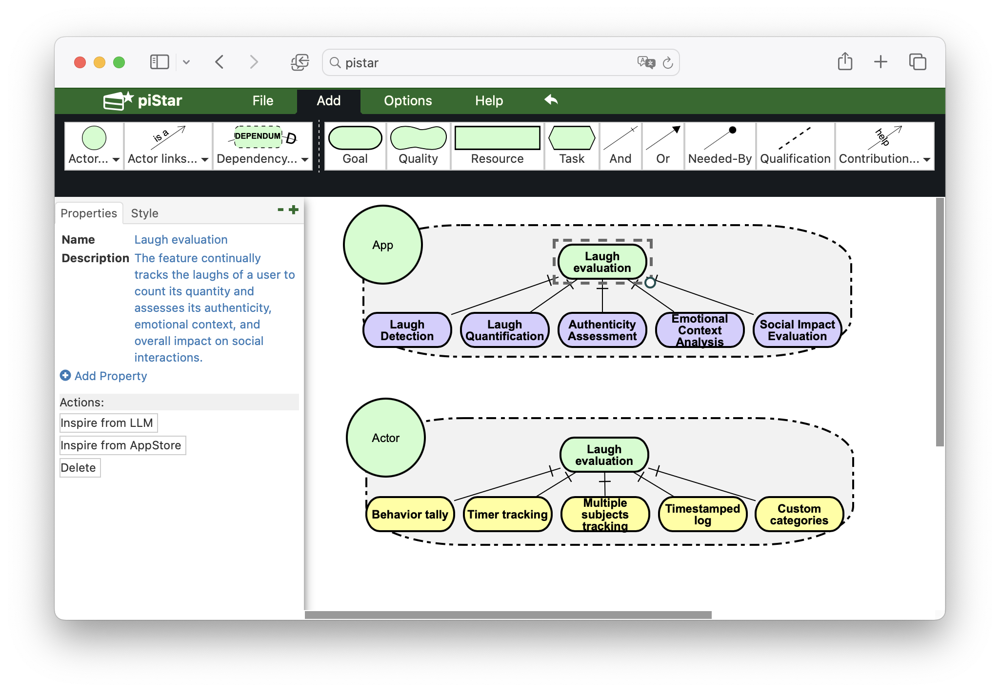

# Getting Inspiration for Feature Elicitation: App Store- vs. LLM-based Approach

## About the project

The code of LLM-inspired approach is in `llm.py`.
The code of AppStore-inspired approach is in `gp.py`.

The `description` folder contains the code for creating the app description vector database.

The features we used for evaluation can be found in the `evaluation` folder.

### Note about vector database
During our evaluation, we used `Qdrant` as the local vector database to retrieve relevant app descriptions in `AppStore-Inspiration`. 
However, due to the size limitations, we cannot provide the storage file for the vector database.
Therefore, we have commented out the code related to `Qdrant`.
However, the dataset containing 589k app description is available at https://huggingface.co/datasets/Jl-wei/gp-app-description.

As an alternative, the tool uses the Google Play search engine to find relevant app descriptions.
Please note that this alternative has lower performance compared to using our vector database.

## Getting Started

1. Install `poetry` ([link](https://python-poetry.org/))

2. Install dependencies
```
poetry install
```

3. Set environ variable `OPENAI_API_KEY`
```
export OPENAI_API_KEY="your api key"
```

## Usage
### Launch the inspiration service
```
uvicorn server:app --port 12345
```

### Play with piStar

Open `piStar/tool/index.html`. `piStar` is an open-source goal modelling tool ([link](https://github.com/jhcp/pistar)).



## Citation
If you find our work useful, please cite our paper:
```bibtex
@inproceedings{Wei:GettingInspirationFeature:2024,
	title = {Getting Inspiration for Feature Elicitation: App Store- vs. LLM-based Approach},
	author = {Wei, Jialiang and Courbis, Anne-Lise and Lambolais, Thomas and Xu, Binbin and Bernard, Pierre Louis and Dray, Gérard and Maalej, Walid},
	booktitle = {39th IEEE/ACM International Conference on Automated Software Engineering (ASE'24)},
	year = {2024},
	doi = {10.1145/3691620.3695591},
	publisher = {ACM}
}
```
